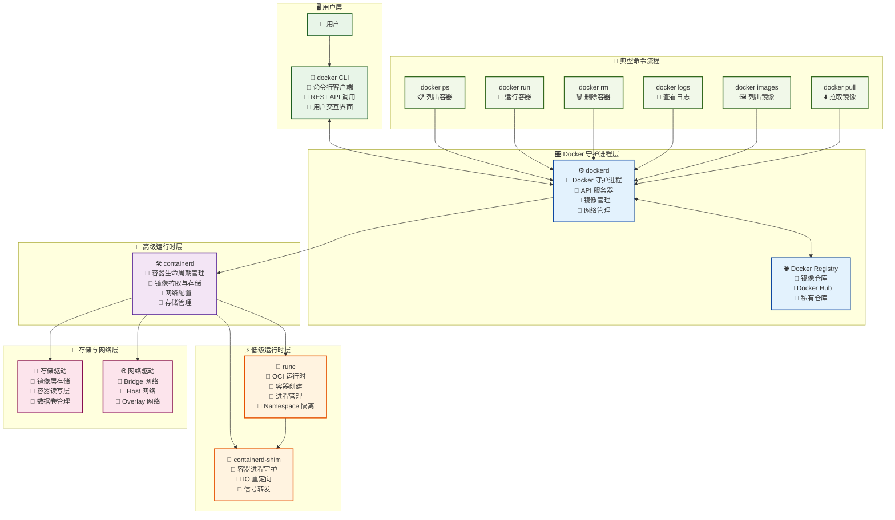
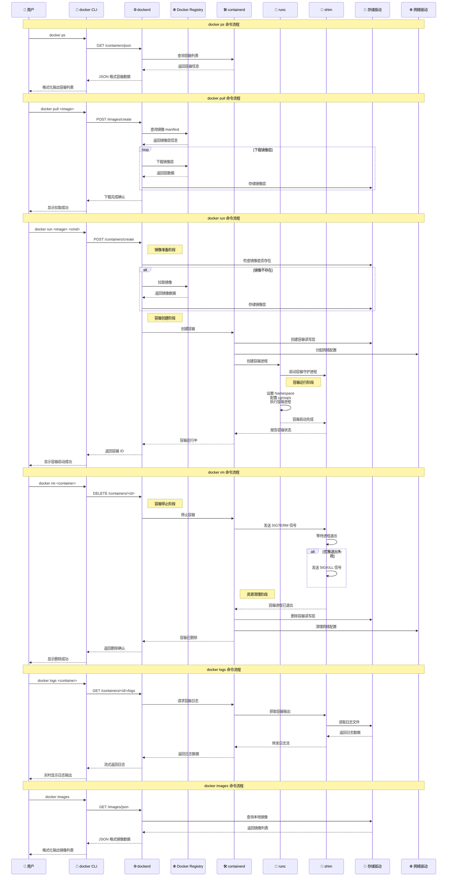

---
{"publish":true,"permalink":"/Sources/AIGC/docker 命令执行流程图.md","title":"docker 命令执行流程图","created":"2025-01-28","modified":"2025-01-28","published":"2025-07-10T20:24:23.878+08:00","tags":["docker","流程图","mermaid","架构图","容器技术","AI生成"],"cssclasses":""}
---

# 🐋 Docker 命令执行流程图

> 详细展示 docker 典型命令在 Docker 系统各层组件间的流程流转

## 📋 快速导航

- [[Sources/AIGC/docker 命令执行流程图#🏗️ Docker 整体架构图]]
- [[Sources/AIGC/docker 命令执行流程图#⏱️ 详细执行时序图]]
- [[Sources/AIGC/docker 命令执行流程图#🔍 关键流程说明]]
- [[Sources/AIGC/docker 命令执行流程图#🔗 相关资源]]

---

## 🏗️ Docker 整体架构图

---

## ⏱️ 详细执行时序图

---

## 🔍 关键流程说明

### 📋 docker ps 查询流程
1. **API 调用**：docker CLI 向 dockerd 发送 REST API 请求
2. **容器查询**：dockerd 通过 containerd 获取容器状态信息
3. **结果返回**：数据经过格式化后返回给用户

### ⬇️ docker pull 拉取流程
1. **镜像查询**：dockerd 向 Registry 查询镜像 manifest
2. **层下载**：并行下载镜像的各个层
3. **本地存储**：存储驱动将镜像层保存到本地文件系统

### 🚀 docker run 运行流程
1. **镜像准备**：检查镜像是否存在，不存在则自动拉取
2. **容器创建**：containerd 创建容器实例和网络配置
3. **进程启动**：runc 设置隔离环境并启动容器进程
4. **守护监控**：containerd-shim 负责容器进程的生命周期管理

### 🗑️ docker rm 删除流程
1. **容器停止**：发送 SIGTERM 信号优雅停止，必要时使用 SIGKILL
2. **资源清理**：清理容器读写层、网络配置等资源
3. **状态更新**：从容器列表中移除容器记录

### 📜 docker logs 日志流程
1. **日志请求**：dockerd 通过 containerd 请求容器日志
2. **文件读取**：containerd-shim 从存储中读取日志文件
3. **流式返回**：日志以流的形式实时返回给用户

### 🖼️ docker images 镜像流程
1. **本地查询**：dockerd 通过存储驱动查询本地镜像
2. **元数据获取**：收集镜像大小、创建时间等元数据
3. **格式化输出**：将镜像列表格式化显示给用户

---

## 🏗️ Docker 架构分层说明

### 🖥️ 用户层
- **docker CLI**：用户交互的命令行工具，通过 REST API 与 dockerd 通信

### 🎛️ 守护进程层
- **dockerd**：Docker 的核心守护进程，负责 API 服务、镜像管理、网络管理
- **Docker Registry**：镜像仓库，可以是 Docker Hub 或私有仓库

### 🔧 高级运行时层
- **containerd**：高级容器运行时，负责容器生命周期管理、镜像存储、网络配置

### ⚡ 低级运行时层
- **runc**：OCI 标准的容器运行时，负责实际创建和运行容器
- **containerd-shim**：容器守护进程，负责容器进程的监控和 IO 重定向

### 💾 基础设施层
- **存储驱动**：管理镜像层和容器读写层（overlay2、aufs 等）
- **网络驱动**：提供容器网络功能（bridge、host、overlay 等）

---

## 🔗 相关资源

### 容器技术基础
- [[Spaces/2-Area/云服务和部署/cri容器运行时-containerd]]：容器运行时详解
- [[docker 实践]]：Docker 实战指南

### 相关架构图
- [[Sources/AIGC/kubectl 命令执行流程图]]：k8s 命令执行流程
- [[k8s技术架构图]]：Kubernetes 架构对比

### 学习资源
- [Docker 官方文档](https://docs.docker.com/)：Docker 官方文档
- [containerd 文档](https://containerd.io/)：containerd 官方文档
- [OCI 规范](https://opencontainers.org/)：开放容器标准

---

## 💡 实用提示

### 🔧 调试技巧
- 使用 `docker system df` 查看 Docker 空间使用情况
- 使用 `docker system events` 实时监控 Docker 事件
- 使用 `docker inspect` 查看容器或镜像的详细信息

### 🚀 性能优化
- 使用多阶段构建减小镜像大小
- 合理使用 `.dockerignore` 文件
- 利用镜像层缓存机制加速构建

### 🔒 安全最佳实践
- 不在镜像中存储敏感信息
- 使用非 root 用户运行容器
- 定期更新基础镜像和依赖

---

> **说明**：本文档详细展示了 Docker 各组件间的交互流程，有助于理解 Docker 的内部工作机制和容器技术的底层原理。 