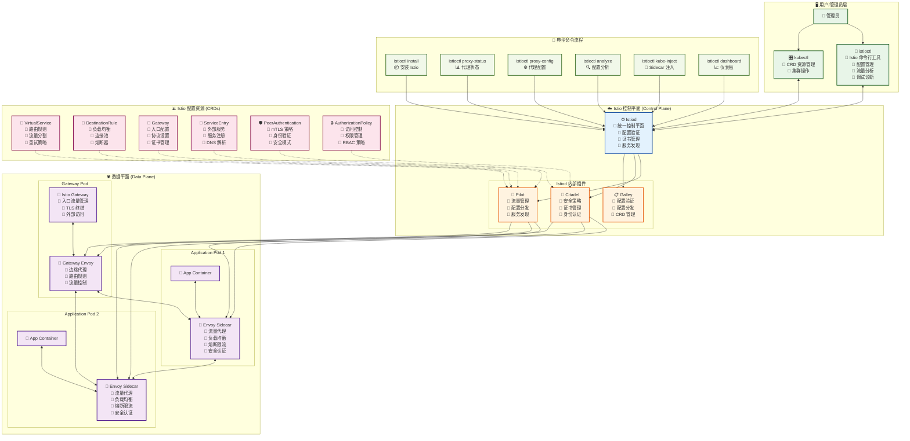
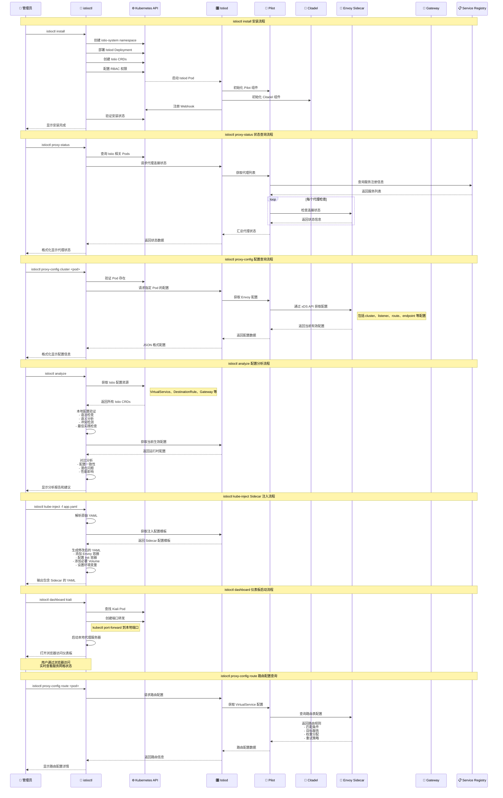

---
{"publish":true,"permalink":"/Sources/AIGC/istio 架构与命令执行流程图.md","title":"Istio 架构与命令执行流程图","created":"2025-01-28","modified":"2025-01-28","published":"2025-07-10T20:24:29.102+08:00","tags":["istio","服务网格","流程图","mermaid","架构图","云原生","AI生成"],"cssclasses":""}
---

# 🕸️ Istio 架构与命令执行流程图

> 详细展示 Istio 服务网格架构和 istioctl 典型命令在各组件间的流程流转

## 📋 快速导航

- [[Sources/AIGC/istio 架构与命令执行流程图#🏗️ Istio 整体架构图]]
- [[Sources/AIGC/istio 架构与命令执行流程图#⏱️ istioctl 命令执行时序图]]
- [[Sources/AIGC/istio 架构与命令执行流程图#🔍 关键流程说明]]
- [[Sources/AIGC/istio 架构与命令执行流程图#🔗 相关资源]]

---

## 🏗️ Istio 整体架构图

---

## ⏱️ istioctl 命令执行时序图

---

## 🔍 关键流程说明

### 📦 istioctl install 安装流程
1. **资源创建**：创建 istio-system namespace 和必要的 CRDs
2. **组件部署**：部署 Istiod 统一控制平面
3. **权限配置**：设置 RBAC 权限和 ServiceAccount
4. **Webhook 注册**：注册 Sidecar 自动注入 Webhook
5. **状态验证**：验证所有组件是否正常运行

### 📊 istioctl proxy-status 状态查询流程
1. **连接查询**：检查所有 Envoy 代理与 Istiod 的连接状态
2. **配置同步**：验证配置是否已正确同步到代理
3. **健康检查**：检查代理的健康状态和资源使用情况

### ⚙️ istioctl proxy-config 配置查询流程
1. **配置获取**：通过 xDS API 获取指定代理的实时配置
2. **多类型支持**：支持 cluster、listener、route、endpoint 等配置查询
3. **格式化输出**：将 Envoy 原始配置转换为可读格式

### 🔍 istioctl analyze 配置分析流程
1. **资源收集**：收集所有 Istio 配置资源
2. **静态分析**：进行语法检查、语义验证和冲突检测
3. **运行时对比**：对比配置与实际运行状态的差异
4. **问题诊断**：识别潜在问题并提供修复建议

### 💉 istioctl kube-inject Sidecar 注入流程
1. **模板获取**：从 Istiod 获取 Sidecar 注入配置模板
2. **YAML 修改**：在原始 Pod 配置中添加 Envoy 容器和 Init 容器
3. **配置生成**：生成包含完整 Sidecar 配置的新 YAML

### 📈 istioctl dashboard 仪表板流程
1. **服务发现**：查找目标仪表板 Pod（如 Kiali、Grafana 等）
2. **端口转发**：创建从本地到 Pod 的端口转发
3. **浏览器启动**：自动打开浏览器访问仪表板

---

## 🏗️ Istio 架构分层说明

### 🖥️ 用户/管理员层
- **istioctl**：Istio 专用命令行工具，提供安装、配置、调试等功能
- **kubectl**：Kubernetes 原生工具，用于管理 Istio CRD 资源

### ☁️ 控制平面 (Control Plane)
- **Istiod**：统一的控制平面，整合了之前版本的多个组件
  - **Pilot**：流量管理和服务发现
  - **Citadel**：安全策略和证书管理
  - **Galley**：配置验证和分发

### 🌐 数据平面 (Data Plane)
- **Envoy Sidecar**：与应用容器共享 Pod 的代理
- **Istio Gateway**：处理进出集群流量的边缘代理

### 📊 配置资源 (CRDs)
- **流量管理**：VirtualService、DestinationRule、Gateway、ServiceEntry
- **安全策略**：PeerAuthentication、AuthorizationPolicy

---

## 🔗 相关资源

### 实践指南
- [[Spaces/2-Area/云服务和部署/istio基于gateway网关的灰度发布]]：Gateway 和 VirtualService 灰度发布实践
- [[Spaces/1-Project/求职/Istio]]：Istio 学习资源汇总
- [[Cards/再读istio官方文档的笔记]]：官方文档学习笔记

### 相关架构图
- [[Sources/AIGC/kubectl 命令执行流程图]]：k8s 命令执行流程
- [[Sources/AIGC/docker 命令执行流程图]]：Docker 命令执行流程
- [[Spaces/2-Area/云服务和部署/∑ 云计算与云原生]]：云原生技术体系

### 学习资源
- [Istio 官方文档](https://istio.io/latest/docs/)：Istio 官方文档
- [Envoy 文档](https://www.envoyproxy.io/docs/)：Envoy 代理文档
- [Service Mesh 指南](https://www.servicemesher.com/)：中文服务网格社区

---

## 💡 实用提示

### 🔧 调试技巧
- 使用 `istioctl proxy-status` 快速检查网格健康状态
- 使用 `istioctl analyze` 在应用配置前验证配置正确性
- 使用 `istioctl proxy-config` 查看 Envoy 实际生效的配置
- 使用 `istioctl dashboard kiali` 可视化服务网格拓扑

### 🚀 性能优化
- 合理配置 DestinationRule 中的连接池设置
- 使用熔断器防止级联故障
- 配置适当的超时和重试策略
- 监控 Envoy 内存和 CPU 使用情况

### 🔒 安全最佳实践
- 启用 mTLS 进行服务间通信加密
- 使用 AuthorizationPolicy 实现细粒度访问控制
- 定期轮换证书
- 监控异常流量和访问模式

### 📊 可观测性
- 集成 Prometheus 和 Grafana 进行指标监控
- 使用 Jaeger 进行分布式链路追踪
- 启用访问日志进行流量分析
- 配置告警规则监控网格健康状态

---

> **说明**：本文档基于 [[Spaces/2-Area/云服务和部署/istio基于gateway网关的灰度发布]] 等实践经验创建，详细展示了 Istio 服务网格的架构设计和 istioctl 工具的工作原理，有助于深入理解服务网格技术。 