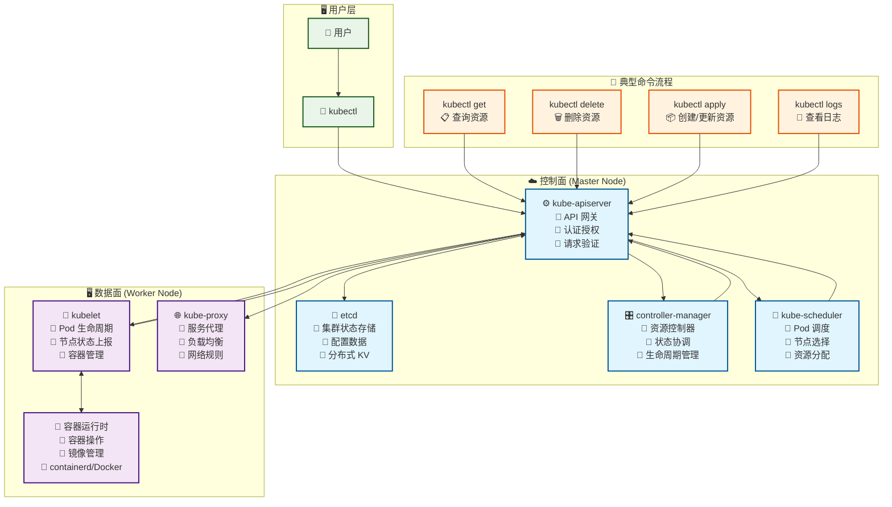
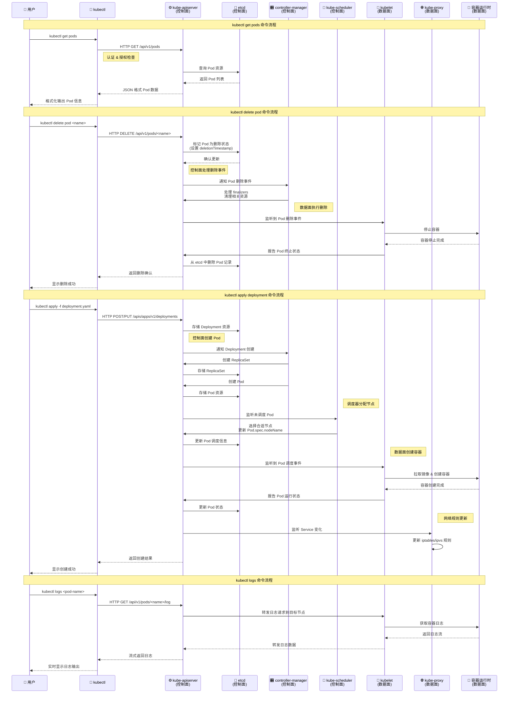

---
{"publish":true,"permalink":"/Sources/AIGC/kubectl 命令执行流程图.md","title":"kubectl 命令执行流程图","created":"2025-01-28","modified":"2025-01-28","published":"2025-07-10T20:24:19.565+08:00","tags":["k8s","kubectl","流程图","mermaid","架构图","AI生成"],"cssclasses":""}
---

# 🔧 kubectl 命令执行流程图

> 详细展示 kubectl 典型命令在 k8s 控制面和数据面各组件间的流程流转

## 📋 快速导航

- [[Sources/AIGC/kubectl 命令执行流程图#🏗️ 整体架构图]]
- [[Sources/AIGC/kubectl 命令执行流程图#⏱️ 详细执行时序图]]
- [[Sources/AIGC/kubectl 命令执行流程图#🔍 关键流程说明]]
- [[Sources/AIGC/kubectl 命令执行流程图#🔗 相关资源]]

---

## 🏗️ 整体架构图

---

## ⏱️ 详细执行时序图

---

## 🔍 关键流程说明

### 📋 kubectl get 查询流程
1. **认证授权**：kubectl 向 API Server 发送 HTTP GET 请求
2. **数据查询**：API Server 从 etcd 获取资源数据
3. **结果返回**：数据经过格式化后返回给用户

### 🗑️ kubectl delete 删除流程
1. **标记删除**：API Server 在 etcd 中标记资源为删除状态
2. **控制面处理**：Controller Manager 处理删除逻辑和 finalizers
3. **数据面执行**：kubelet 停止容器，最终从 etcd 中移除记录

### 📦 kubectl apply 创建流程
1. **资源存储**：API Server 将 Deployment 存储到 etcd
2. **控制器响应**：Controller Manager 创建 ReplicaSet 和 Pod
3. **调度分配**：Scheduler 为 Pod 选择合适的节点
4. **容器创建**：kubelet 通过 CRI 创建实际容器
5. **网络配置**：kube-proxy 更新网络规则

### 📜 kubectl logs 日志流程
1. **请求转发**：API Server 将日志请求转发到目标节点
2. **日志获取**：kubelet 从容器运行时获取日志数据
3. **流式返回**：日志以流的形式实时返回给用户

---

## 🔗 相关资源

### 核心组件文档
- [[Sources/AIGC/∑ k8s 入门到精通 MOC]]：完整学习路径
- [[Spaces/1-Project/ack和k8s/kubernetes 核心组件及架构]]：组件详解
- [[k8s技术架构图]]：现有架构图

### 工具链相关
- [[Spaces/3-Resource/软件梳理/linux常用命令/kubectl]]：命令行工具详解
- [[Cards/kubelet]]：节点代理组件
- [[Spaces/1-Project/ack和k8s/kube-proxy]]：网络代理组件

### 实践指南
- [[Spaces/1-Project/ack和k8s/k8s 快速入门]]：快速上手指南
- [[k8s 本地开发]]：本地开发环境

---

> **说明**：本文档基于 [[Sources/AIGC/∑ k8s 入门到精通 MOC]] 的知识体系创建，旨在提供 kubectl 命令执行的可视化流程参考。 