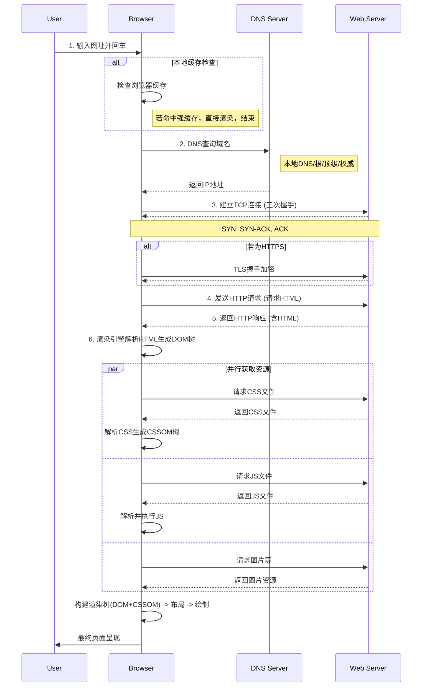

---
{"publish":true,"permalink":"/Sources/AIGC/从浏览器输入一个网址到得到网站页面，中间发生了什么.md","created":"2025-07-10","modified":"2025-07-10","published":"2025-07-10T20:23:59.210+08:00","tags":["AI生成"],"cssclasses":""}
---

# 从浏览器输入一个网址到得到网站页面，中间发生了什么

当您在浏览器地址栏输入一个网址并按下回车键时，一场复杂而精妙的旅程便开始了。这个过程可以概括为以下几个核心阶段：

### 1. URL 解析与本地缓存检查

浏览器首先会解析您输入的 [[URL]] (Uniform Resource Locator)，拆解出协议（如 `https`）、域名（如 `www.example.com`）和路径（如 `/index.html`）。

紧接着，它会进行一次“本地侦查”，检查自身缓存中是否已有该请求的资源。这个检查遵循一个优先级顺序：

1. **[[浏览器缓存]] (Browser Cache)**：检查是否有最近访问过的、且未过期的该页面副本。如果命中（强缓存），则直接从本地硬盘读取，这是最快的方式，网络请求都不会发生。
2. **[[DNS]] 缓存 (DNS Cache)**：如果浏览器缓存未命中，浏览器会查找本地的 DNS 缓存，看是否已经有该域名对应的 [[IP地址]]。这个缓存存在于浏览器、操作系统、路由器等多个层面。

### 2. DNS 查询 (域名解析)

如果在所有本地缓存中都找不到域名对应的 IP 地址，浏览器就会启动 [[DNS查询]]，将我们熟悉的域名“翻译”成机器能够理解的 IP 地址。

这个过程是递归的：

1. 浏览器向本地配置的 **DNS 服务器**（通常由您的网络服务提供商 ISP 提供）发起请求。
2. 如果本地 DNS 服务器没有缓存，它会向 **[[根域名服务器]] (Root DNS Server)** 发出请求。
3. 根服务器会根据域名的顶级域（如 `.com`），指引本地服务器去查询对应的**[[顶级域服务器]] (TLD Server)**。
4. 顶级域服务器再根据二级域名（如 `example.com`），指引本地服务器去查询对应的**[[权威域名服务器]] (Authoritative Name Server)**。
5. 权威域名服务器掌管着该域名的最终解析记录，将 IP 地址返回给本地 DNS 服务器。
6. 本地 DNS 服务器将结果缓存起来，并返回给浏览器。

### 3. 建立 TCP 连接

拿到服务器的 IP 地址后，浏览器便开始与服务器建立连接。对于 `HTTP` 或 `HTTPS` 协议，这通常是通过 **[[TCP-IP协议]]** 完成的。

这个过程最著名的就是 **[[TCP三次握手]] (Three-Way Handshake)**，确保双方都准备好进行数据传输：

1. **SYN**: 客户端（浏览器）向服务器发送一个 SYN 包，表示“我想和你建立连接”。
2. **SYN-ACK**: 服务器收到后，返回一个 SYN-ACK 包，表示“我收到了，同意连接，你也准备好了吗？”。
3. **ACK**: 客户端再发送一个 ACK 包，表示“我也准备好了，我们开始通信吧！”。

至此，一条可靠的数据传输通道就建立起来了。

### 4. 发起 HTTP/S 请求

连接建立后，浏览器会构造并发送一个 **[[HTTP请求报文]]** 给服务器。

这个报文通常包含：

- **请求行 (Request Line)**：如 `GET /index.html HTTP/1.1`，包含了请求方法、路径和协议版本。
- **请求头 (Request Headers)**：包含了浏览器类型、可接受的内容格式、[[Cookie]] 等大量附加信息。
- **请求体 (Request Body)**：对于 `GET` 请求通常为空，但对于 `POST` 请求，则包含了需要提交的数据。

如果协议是 [[Cards/HTTPS]]，在 TCP 连接之上，还会进行 **[[TLS-SSL握手]]**，对通信内容进行加密，确保数据传输的安全性。

### 5. 服务器处理请求并返回响应

服务器（如 [[Spaces/2-Area/云服务和部署/nginx]], [[Apache]]）接收到请求后，会进行处理：

1. **解析请求**：服务器软件解析请求报文，了解客户端的意图。
2. **处理业务逻辑**：可能会查询[[Cards/数据库]]、调用后端服务、执行业务逻辑代码等。
3. **构造响应**：生成一个 **[[HTTP响应报文]]**。

这个响应报文包含：

- **状态行 (Status Line)**：如 `HTTP/1.1 200 OK`，包含了协议版本、状态码和状态描述。
- **响应头 (Response Headers)**：包含了服务器信息、内容类型、缓存策略（告诉浏览器这个资源下次是否可以直接用缓存）等。
- **响应体 (Response Body)**：包含了请求的实际内容，通常是 HTML 文本。

### 6. 浏览器渲染页面

浏览器接收到服务器的响应后，就开始了将代码变为可视化页面的渲染过程。

1. **解析 HTML 生成 [[DOM]] 树**：浏览器自上而下解析 HTML 文档，构建一个树状的 **文档对象模型 (DOM Tree)**。
2. **解析 CSS 生成 [[CSSOM]] 树**：同时，浏览器会解析 CSS 文件（包括外部链接的、内嵌的、行内的），构建一个 **CSS 规则树 (CSSOM Tree)**。
3. **构建[[渲染树]] (Render Tree)**：将 DOM 树和 CSSOM 树结合起来，生成渲染树。这棵树只包含需要显示在页面上的节点及其样式信息（比如 `display:none` 的元素就不会在渲染树中）。
4. **布局 (Layout/Reflow)**：浏览器根据渲染树，计算出每个节点在屏幕上的精确位置和大小，这个过程也称为 [[回流与重绘\|回流(Reflow)]]。
5. **绘制 (Painting)**：浏览器调用图形库，将各个节点绘制在屏幕上，这个过程也称为 [[回流与重绘\|重绘(Repaint)]]。

在解析 HTML 的过程中，如果遇到 ``, `<script>`, `<link>` 等标签，浏览器会再次发起新的 HTTP 请求去获取这些外部资源，并可能会重复上述的 DNS 查询、TCP 连接等过程。这些资源的加载可能会阻塞或改变 DOM 的构建，这也是[[前端性能优化]]中需要重点关注的地方。

至此，一个完整的网页就呈现在您眼前了。

## mermaid图

