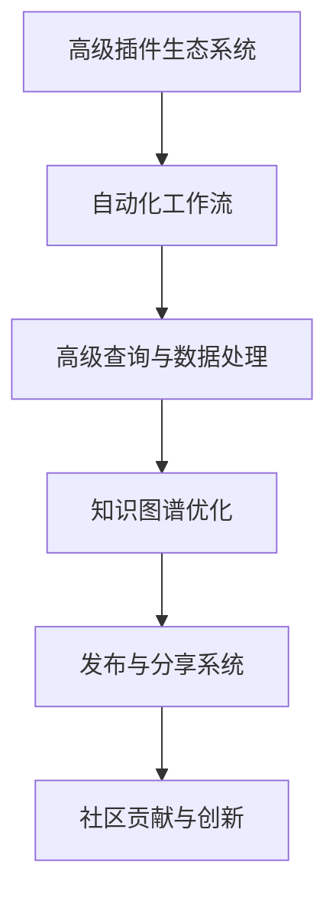
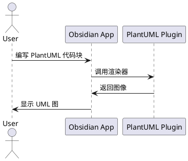
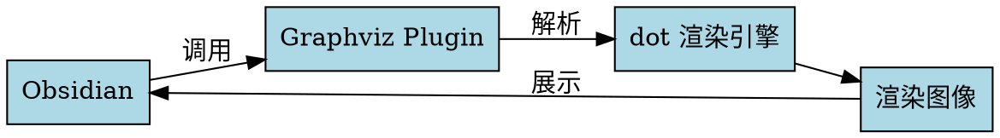

---
{"publish":true,"permalink":"/🍀 花园导览/🧰 本库指南/Obsidian/Plugins/Diagram Zoom Drag.md","created":"2025-06-06","modified":"2025-07-10","published":"2025-07-10T21:07:12.098+08:00","tags":["obsidian插件"],"cssclasses":""}
---

给自带的[[Cards/mermaid]]加上方便查看的按钮，以及给其他几个常用图形工具也加上查看按钮。

让ai频繁地生成mermaid的话，还是非常有用的。比如[[📥 Inbox/让cursor把各种流程用mermaid画一遍]]中花的各种流程图，用原生ob自带的，压根儿看不了。

##

自带mermaid支持

##

需要插件[[🍀 花园导览/🧰 本库指南/Obsidian/Plugins/PlantUML]]

##

需要安装[[🍀 花园导览/🧰 本库指南/Obsidian/Plugins/Graphviz]]插件，并安装dot命令行，配置`C:\Program Files\Graphviz\bin\dot.exe`

##

需要 [[🍀 花园导览/🧰 本库指南/Obsidian/Plugins/Mehrmaid]]插件，让mermaid支持内嵌markdown。
